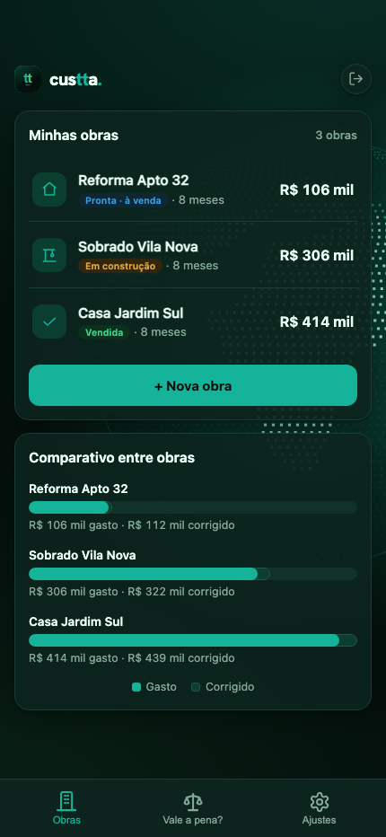
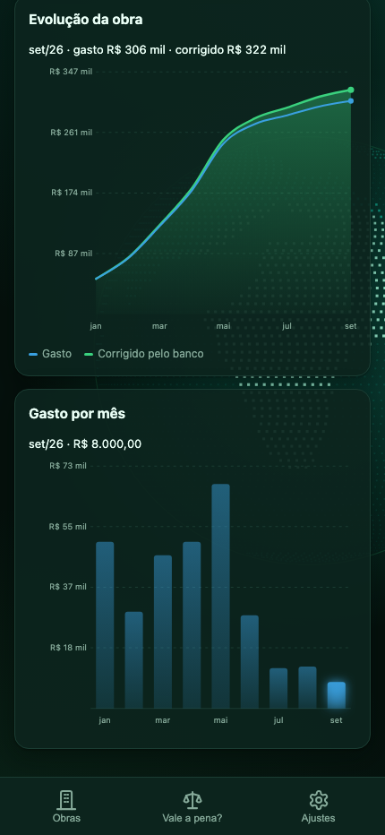

# custta.

**Controle de custos e lucro por obra, na ponta do lápis.**

PWA offline-first para acompanhar quanto cada obra custou, quanto o dinheiro renderia no banco no mesmo período (valor corrigido) e o lucro real na venda — bruto e acima do banco.

<table>
  <tr>
    <td></td>
    <td></td>
    <td></td>
  </tr>
</table>

---

## Sumário

- [Visão geral](#visão-geral)
- [Funcionalidades](#funcionalidades)
- [Arquitetura](#arquitetura)
- [Estrutura do projeto](#estrutura-do-projeto)
- [Por que a raiz tem tantos arquivos](#por-que-a-raiz-tem-tantos-arquivos)
- [Documentação](#documentação)
- [Licença](#licença)

## Visão geral

Custta é um aplicativo instalável (PWA) para construtores acompanharem o custo de suas obras no dia a dia. O uso é primariamente no celular: ao pagar um fornecedor ou fechar uma compra, o gasto é lançado; a qualquer momento a pessoa confere o total gasto, o valor corrigido e a margem.

O produto é pensado para um usuário não técnico, com foco em **clareza em 5 segundos**: um número importante por vez, tipografia generosa e linguagem simples em PT-BR.

## Funcionalidades

- **Gastos por obra** organizados por tópico (terreno, fundação, acabamento…), pagos via Pix ou cartão parcelável.
- **Valor bruto × valor corrigido** — quanto o dinheiro renderia no banco no período, com taxa configurável (padrão 1% a.m.).
- **Lucro na venda** — apurado em dois eixos: bruto e acima do rendimento de banco.
- **Ciclo de vida da obra** em três fases: em construção → pronta (à venda) → vendida.
- **Gráficos**: distribuição por tópico (donut) e gasto por mês.
- **Simulador "Vale a pena?"** — margem estimada por preço de venda.
- **Offline-first** — dados persistidos no aparelho; sincronização em nuvem quando há rede.
- **Multiusuário** — login por conta (Firebase), dados isolados por usuário.

## Arquitetura

Aplicação **vanilla**: HTML, CSS e JavaScript servidos como arquivos estáticos,
sem framework e sem etapa de build no deploy. O estado do usuário é um único
documento no Firestore, sincronizado em tempo real e disponível offline pelo
IndexedDB do próprio SDK. `calc.js` concentra os cálculos financeiros e não toca
no DOM, o que o torna testável em Node; `cloud.js` é o único ponto de contato
com o Firebase; `sw.js` é network-first, então o cache só serve como retrato
para o modo offline.

O diagrama do fluxo de dados, a tabela de globais, a fronteira de segurança e a
camada nativa estão em **[docs/ARQUITETURA.md](docs/ARQUITETURA.md)**.

## Estrutura do projeto

| Caminho | Responsabilidade |
| --- | --- |
| `index.html` | markup da página — sem CSS e sem JavaScript inline (exigência da CSP) |
| `styles.css` | todo o CSS do app: temas, skins e componentes |
| `app.js` | estado e render da interface |
| `calc.js` | cálculos puros de obra (correção monetária, parcelas) — sem DOM |
| `cloud.js`, `auth.js` | Firebase (Auth + Firestore) e a tela de login |
| `nativo.js`, `push.js`, `share.js`, `ui-confirm.js` | camada nativa, notificações, exportação e diálogos |
| `sw.js`, `manifest.json` | service worker e manifesto do PWA |
| `firestore.rules` | as regras que de fato protegem os dados |
| `vendor/` | SDKs do Firebase e do Sentry, versionados em vez de vindos de CDN |
| `ios/` | projeto Capacitor do app para iPhone |
| `api/`, `notificacoes/` | função de cron e o job de notificações — não fazem parte do app web |
| `tests/` | unidade, rules e suítes de browser |
| `docs/` | arquitetura, specs e planos |

## Por que a raiz tem tantos arquivos

O app não tem bundler nem etapa de build: os arquivos da raiz são exatamente o que o navegador baixa. `index.html` carrega cada script na ordem declarada, `styles.css` traz todo o CSS e `sw.js` lista esses mesmos arquivos no precache. `package.json` existe para testes, manutenção do SDK local (`vendor/`), Capacitor e a função de cron em `api/` — nada dele vai para o navegador. O projeto iOS fica em `ios/`; `www/` é gerado por `npm run build:www` e não é versionado.

## Documentação

- **[docs/ARQUITETURA.md](docs/ARQUITETURA.md)** — fluxo de dados, globais, segurança, service worker, push e camada nativa.
- **[AGENTS.md](AGENTS.md)** — idioma, estilo de commit, como rodar os testes e o que quebra produção.
- **[PRODUCT.md](PRODUCT.md)** — usuário-alvo e princípios de design.
- **[docs/planejamento-app-store.md](docs/planejamento-app-store.md)** — as fases do caminho até a App Store.
- **[docs/specs/](docs/specs/)** e **[docs/plans/](docs/plans/)** — o spec e o plano de cada funcionalidade, antes do código.

## Licença

Proprietária — ver [LICENSE](LICENSE). O código é público para leitura e
avaliação; uso, redistribuição e publicação em loja dependem de autorização
por escrito.
