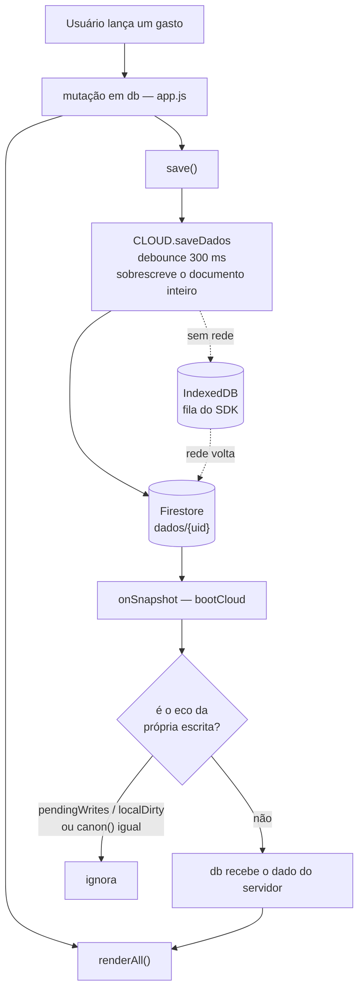

# Arquitetura

O Custta é um PWA offline-first sem framework, sem bundler e **sem etapa de
build**: os arquivos da raiz do repositório são exatamente o que o navegador
baixa. O backend é Firebase (Auth + Firestore) e o deploy é na Vercel. O mesmo
código roda como app iOS, empacotado com Capacitor.

## Fluxo de dados

Todo o estado do usuário é um documento só no Firestore, `dados/{uid}`, com a
forma `{ obras: [...], config: { taxaMensal, topicosCustom } }`. Não há
localStorage de dados — só preferências do aparelho (`mo_tema`, `mo_skin`,
`splashVista`, `custta-estado`).



Duas consequências práticas que já custaram bug:

- **`saveDados` reescreve o blob inteiro.** Qualquer coisa que não possa ser
  sobrescrita por outro aparelho mora em documento separado — foi por isso que
  as inscrições de push viraram `push/{uid}`.
- Depois de mexer em `db`, sempre `save()` **e** `renderAll()` (ou o `render*`
  da view afetada). Um sem o outro salva sem mostrar, ou mostra sem salvar.

Formato de uma obra:

```js
{ id, nome, fase: 'construcao' | 'pronta' | 'vendida', dataInicio,
  valorEstimadoVenda, areaM2, gastos: [], afazeres?: [] }
```

Formato de um gasto: `{ id, valor, topico, descricao, data, pagamento }`. Uma
compra parcelada no cartão gera N gastos irmãos com o mesmo `grupoId` e
`parcela: { n, de }`.

## Os arquivos e o que cada um expõe

Scripts clássicos com variáveis globais, carregados na ordem declarada no fim
do `index.html`. Não há `import` entre eles — a exceção é o `cloud.js`, que é
`type="module"`. A comunicação é por global.

| Arquivo | Global | Papel |
| --- | --- | --- |
| `calc.js` | `OBRA_CALC` | regras de negócio puras, zero DOM — é o que os testes de unidade cobrem |
| `cloud.js` | `window.CLOUD`, evento `cloud-pronto` | único ponto de contato com o Firebase |
| `dados.js` | `normaliza` | valida a forma do documento e os limites de texto |
| `auth.js` | — | overlay de login (`#auth` + `body.locked`) |
| `app.js` | `db`, `renderAll`, `OBRA_DIAG` | todo o estado e o render da UI |
| `nativo.js` | `OBRA_NATIVO` | único ponto que toca `window.Capacitor`; na web é tudo neutro |
| `push.js` | `OBRA_PUSH` | notificações: Web Push na web, FCM no app iOS |
| `share.js` | `OBRA_SHARE` | exportação em JSON e CSV, e o recorte de uma obra só |
| `ui-confirm.js` | `OBRA_CONTA`, `OBRA_CONFIRM` | diálogos de conta e as confirmações que substituem `confirm()` |
| `teclado.js` | `TECLADO` | teclado numérico próprio para digitar valor |
| `icons.js` | `ICON` | ícones SVG inline (`data-ico`) |
| `tema.js` | — | aplica tema e skin antes do primeiro paint |
| `sw.js` | — | service worker, estratégia network-first |
| `styles.css` | — | **todo** o CSS do app; `privacidade.css` serve só a página de privacidade |

## Fronteira de segurança

A `apiKey` em `cloud.js` é **pública por design** — é identificador de projeto,
não credencial. A segurança está em `firestore.rules`, que valida a forma do
documento (`hasOnly`, limites de tamanho, faixa da `taxaMensal`) em
`dados/{uid}`, `perfis/{uid}` e `push/{uid}`.

Por isso, **adicionar uma chave de topo em `db` quebra as escritas em produção**
se as rules não forem atualizadas junto. O caminho é: editar `firestore.rules`,
somar um caso em `tests/rules.test.mjs`, rodar `npm run test:rules` e só então
`npm run rules:deploy`. As rules nunca são editadas pelo console do Firebase —
o console não tem histórico nem revisão.

A CSP definida no `vercel.json` é estrita (`default-src 'none'`,
`script-src 'self'`, `style-src-attr 'none'`): não existe CSS nem JavaScript
inline no HTML. Os SDKs do Firebase e do Sentry ficam versionados em `vendor/`,
não são carregados de CDN, e a CI falha se o diff dessa pasta não estiver limpo.

## Service worker e cache

`sw.js` é network-first: online, sempre busca a versão mais recente; o cache
serve como retrato para o modo offline.

Ao criar um arquivo JS ou CSS novo na raiz, ele entra na lista `ASSETS` **e** o
`CACHE` é incrementado (`obras-vNN`). Sem o incremento, o aparelho que já tem o
app instalado continua servindo o retrato antigo quando estiver sem rede. A
mesma lista `ASSETS` é lida pelo `scripts/build-www.mjs` para montar o `www/`
do app iOS — ela é a definição única de "o que é o app".

## Notificações

Duas implementações atrás da mesma interface `OBRA_PUSH`:

- **Web:** Web Push com VAPID. A inscrição vira `push/{uid}.subs.<chave>`.
- **iOS:** FCM pelo `@capacitor-firebase/messaging`. O token vira
  `push/{uid}.tokens.<chave>`.

As rules limitam os dois mapas a 10 entradas. O documento é separado de
`dados/{uid}` de propósito: `saveDados` sobrescreve o blob inteiro e apagaria as
inscrições feitas em outro aparelho.

O envio é um job em `notificacoes/`, com `package.json` próprio, que roda com o
Admin SDK (ignora as rules). Hoje ele é disparado pelo GitHub Actions duas vezes
ao dia — 12:00 UTC (9h de Brasília) e 21:00 UTC (18h) — e o período (`manha` ou
`noite`) é derivado do cron que disparou. Existe também `api/push-diario.js`,
pronto para o Vercel Cron, que responde 503 enquanto a variável `CRON_SECRET`
não existir: os dois caminhos não podem ficar ligados ao mesmo tempo, ou o
usuário recebe em dobro.

## Camada nativa (iOS)

O projeto `ios/` é versionado; `www/` é gerado por `npm run build:www` e não
entra no git. O comportamento nativo é sempre condicionado por
`OBRA_NATIVO.ehNativo()`, e `nativo.js` é o único arquivo que toca
`window.Capacitor` — erro de plugin nunca chega à UI, vira registro em
`OBRA_DIAG` e a função devolve resultado neutro.

O que muda no app em relação ao site: share sheet do iOS na exportação, push
por FCM, vibração ao lançar gasto, barra de status seguindo o tema, splash
nativo, e o service worker não é registrado.

## Testes

| Suíte | Comando | O que exige |
| --- | --- | --- |
| Unidade | `npm run test:unit` | nada — sem rede, sem browser |
| Rules | `npm run test:rules` | Java 21 e o emulador do Firestore |
| Browser | `npm run test:browser` | emuladores + Playwright (Chromium) |

A CI do GitHub roda as suítes em push para `main` e em cada pull request, com
as actions fixadas por SHA.
