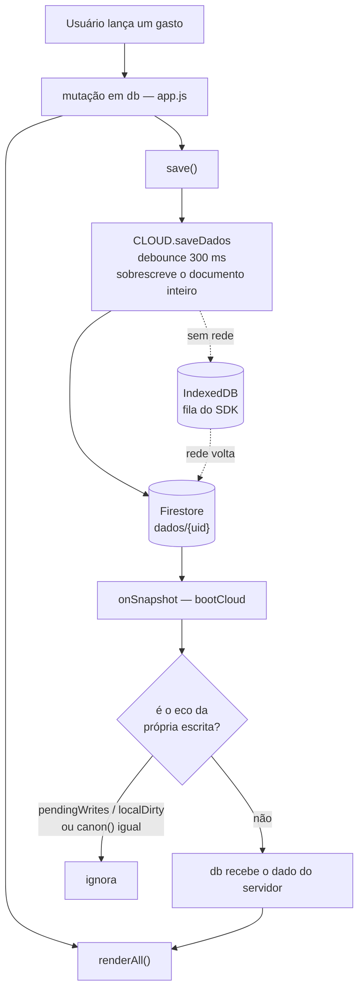

# Apresentação do repositório — Implementation Plan

> **For agentic workers:** REQUIRED SUB-SKILL: Use superpowers:subagent-driven-development (recommended) or superpowers:executing-plans to implement this plan task-by-task. Steps use checkbox (`- [ ]`) syntax for tracking.

**Goal:** Fazer o repositório público do Custta se apresentar como o produto mantido que ele é: licença explícita, capturas no topo do README, documentação com nome próprio e um documento de arquitetura de verdade.

**Architecture:** Cinco entregas independentes, nenhuma tocando código que roda no app. Um único arquivo de teste novo (`tests/docs.test.mjs`) cresce junto com as tarefas e passa a guardar cada uma delas — é ele que impede a documentação de apodrecer em silêncio.

**Tech Stack:** Markdown, `node --test` (ESM), `git mv`, Playwright (só para regerar capturas), Mermaid (renderizado nativamente pelo GitHub).

**Spec:** [docs/specs/2026-09-17-repositorio-profissional-design.md](../specs/2026-09-17-repositorio-profissional-design.md)

## Global Constraints

- **Idioma:** tudo em português do Brasil — conteúdo, comentários de teste e mensagens de commit.
- **Commits:** assunto em minúsculas, sem acento, formato `tipo: o que mudou`. Um commit por tarefa. **Autor único Giovani Stuchi — nunca acrescente linha `Co-Authored-By`.**
- **Quem implementa não dá push.** Só commita. O push e o PR são feitos pelo orquestrador.
- **Branch:** `chore/repo-profissional`. Nunca commitar direto em `main` (é protegida).
- **Nada de dependência nova.** O repositório não ganha pacote npm por causa deste trabalho.
- **Nenhum arquivo que o browser baixa pode mudar.** Se uma tarefa parecer exigir alteração em `index.html`, `app.js`, `styles.css`, `sw.js` ou `vercel.json`, pare e reporte — está fora do escopo.
- **Titular e ano da licença:** `Giovani Stuchi`, `2026`. Contato do projeto: `suportecustta@gmail.com`. URL de produção: `https://app-construcao-civil.vercel.app`.
- Ao terminar cada tarefa, `npm run test:unit` precisa estar verde. Uma tarefa nunca termina com a suíte vermelha.

---

### Task 1: LICENSE proprietária e `tests/docs.test.mjs`

Cria o arquivo de teste que as tarefas seguintes vão alimentar, e a licença.

**Files:**
- Create: `LICENSE`
- Create: `tests/docs.test.mjs`
- Modify: `package.json` (campo `license`; lista do script `test:unit`)

**Interfaces:**
- Consumes: nada.
- Produces: `tests/docs.test.mjs` com as constantes `RAIZ` (caminho absoluto da raiz do repositório), `versionados` (array de caminhos de `git ls-files`) e `ler(rel)` (lê arquivo relativo à raiz como utf8). As tarefas 2 a 6 acrescentam testes **no fim desse arquivo**, reaproveitando essas três coisas.

- [ ] **Step 1: Escrever o teste que falha**

Crie `tests/docs.test.mjs` exatamente com este conteúdo:

```js
/* Guarda a apresentação do repositório: licença, capturas do README, caminhos
   de documentação e links relativos. Nada aqui roda no app — é justamente por
   isso que precisa de teste: documentação quebra em silêncio. */
import { test } from 'node:test';
import assert from 'node:assert/strict';
import { execFileSync } from 'node:child_process';
import { readFileSync, existsSync } from 'node:fs';
import path from 'node:path';
import { fileURLToPath } from 'node:url';

const RAIZ = path.resolve(path.dirname(fileURLToPath(import.meta.url)), '..');
const versionados = execFileSync('git', ['ls-files'], { cwd: RAIZ, encoding: 'utf8' })
  .split('\n').filter(Boolean);
const ler = rel => readFileSync(path.join(RAIZ, rel), 'utf8');

test('LICENSE proprietária, com titular, ano e resumo em inglês', () => {
  const licenca = ler('LICENSE');
  assert.match(licenca, /Copyright \(c\) 2026 Giovani Stuchi/);
  assert.match(licenca, /Todos os direitos reservados/i);
  assert.match(licenca, /All rights reserved/i, 'resumo em inglês — quem revisa app store lê inglês');
  assert.match(licenca, /vendor\//, 'precisa ressalvar as licenças dos SDKs versionados');
  const pkg = JSON.parse(ler('package.json'));
  assert.equal(pkg.license, 'UNLICENSED', 'convenção npm para código proprietário');
  assert.equal(pkg.private, true);
});
```

- [ ] **Step 2: Rodar e ver falhar**

Run: `node --test tests/docs.test.mjs`
Expected: FAIL com `ENOENT ... LICENSE`.

- [ ] **Step 3: Escrever o LICENSE**

Crie `LICENSE` exatamente com este conteúdo:

```
Licença de Uso — Custta

Copyright (c) 2026 Giovani Stuchi. Todos os direitos reservados.

Este repositório é público para leitura, estudo e avaliação técnica do código.
Nenhum outro direito é concedido.

É permitido:

  - ler o código-fonte;
  - clonar o repositório para leitura e avaliação técnica;
  - citar trechos, com atribuição, em contexto educacional ou jornalístico.

É proibido, sem autorização prévia e por escrito do titular:

  - usar o código, no todo ou em parte, em produto próprio ou de terceiros,
    com ou sem fins comerciais;
  - copiar, redistribuir, sublicenciar, vender ou hospedar o código;
  - criar obra derivada;
  - publicar este aplicativo, ou aplicativo derivado dele, em qualquer loja
    de aplicativos.

O nome "Custta", o logotipo e a identidade visual do aplicativo não são
licenciados por este documento.

Bibliotecas de terceiros distribuídas neste repositório — entre elas os SDKs
em vendor/ — mantêm suas próprias licenças, que prevalecem sobre esta para os
arquivos correspondentes.

O SOFTWARE É FORNECIDO "COMO ESTÁ", SEM GARANTIA DE QUALQUER TIPO, EXPRESSA OU
IMPLÍCITA. EM NENHUMA HIPÓTESE O TITULAR RESPONDERÁ POR QUALQUER RECLAMAÇÃO,
DANO OU OUTRA RESPONSABILIDADE DECORRENTE DO SOFTWARE OU DE SEU USO.

--------------------------------------------------------------------------

English summary — Copyright (c) 2026 Giovani Stuchi. All rights reserved.

This source code is published for reading and technical evaluation only. Any
use, copying, modification, redistribution, or publication to an application
store requires prior written permission from the copyright holder. Third-party
libraries vendored in this repository keep their own licenses. The software is
provided "as is", without warranty of any kind.

Contato / contact: suportecustta@gmail.com
```

- [ ] **Step 4: Ajustar o `package.json`**

Duas mudanças:

1. Acrescente o campo `"license": "UNLICENSED"` logo depois de `"version"`.
2. No fim da lista do script `test:unit`, acrescente ` tests/docs.test.mjs` (o script é uma linha só com os arquivos separados por espaço; o novo entra depois de `tests/screenshots.test.mjs`).

- [ ] **Step 5: Rodar e ver passar**

Run: `node --test tests/docs.test.mjs && npm run test:unit`
Expected: PASS nos dois. A suíte inteira precisa continuar verde.

- [ ] **Step 6: Commit**

```bash
git add LICENSE tests/docs.test.mjs package.json
git commit -m "docs: adicionar licenca proprietaria"
```

---

### Task 2: Renomear `docs/superpowers/` para `docs/specs/` e `docs/plans/`

**Files:**
- Move: `docs/superpowers/specs/*` → `docs/specs/`, `docs/superpowers/plans/*` → `docs/plans/`
- Modify: `README.md` (1 link), `CLAUDE.md` (linhas 81 e 95), `teclado.js` (comentário da linha 3), `docs/planejamento-app-store.md` (2 ocorrências), e os documentos movidos que citam o caminho antigo
- Modify: `tests/docs.test.mjs` (acrescentar teste no fim)

**Interfaces:**
- Consumes: `RAIZ`, `versionados`, `ler` da Task 1.
- Produces: os caminhos `docs/specs/` e `docs/plans/`, usados pelas tarefas 3 e 4 na documentação que escrevem.

- [ ] **Step 1: Escrever o teste que falha**

Acrescente no fim de `tests/docs.test.mjs`:

```js
/* O spec e o plano desta própria mudança descrevem a renomeação — citar o
   caminho antigo neles é o registro histórico, não uma referência viva. */
const PODEM_CITAR_CAMINHO_ANTIGO = [
  'docs/specs/2026-09-17-repositorio-profissional-design.md',
  'docs/plans/2026-09-17-repositorio-profissional.md',
  'tests/docs.test.mjs',
];

test('nenhum arquivo aponta mais para a pasta antiga de documentação', () => {
  const antigo = 'docs/' + 'superpowers';
  const textuais = versionados.filter(f =>
    /\.(md|js|mjs|cjs|json|yml|yaml|html|css)$/.test(f) &&
    !f.startsWith('ios/') && !f.startsWith('vendor/') &&
    !PODEM_CITAR_CAMINHO_ANTIGO.includes(f));
  const culpados = textuais.filter(f => ler(f).includes(antigo));
  assert.deepEqual(culpados, [], 'ainda citam o caminho antigo de spec/plano');
  assert.ok(versionados.some(f => f.startsWith('docs/specs/')), 'docs/specs/ precisa existir');
  assert.ok(versionados.some(f => f.startsWith('docs/plans/')), 'docs/plans/ precisa existir');
  assert.ok(!versionados.some(f => f.startsWith(antigo + '/')), 'a pasta antiga precisa sumir do git');
});
```

- [ ] **Step 2: Rodar e ver falhar**

Run: `node --test tests/docs.test.mjs`
Expected: FAIL listando `README.md`, `CLAUDE.md`, `teclado.js`, `docs/planejamento-app-store.md` e os documentos internos.

- [ ] **Step 3: Mover as pastas preservando histórico**

```bash
git mv docs/superpowers/specs/* docs/specs/
git mv docs/superpowers/plans/* docs/plans/
rmdir docs/superpowers/specs docs/superpowers/plans docs/superpowers
```

- [ ] **Step 4: Atualizar todas as referências**

```bash
git ls-files -z -- '*.md' '*.js' '*.mjs' '*.cjs' \
  | grep -zv '^docs/specs/2026-09-17-repositorio-profissional-design.md$' \
  | grep -zv '^docs/plans/2026-09-17-repositorio-profissional.md$' \
  | grep -zv '^tests/docs.test.mjs$' \
  | xargs -0 perl -pi -e 's{docs/superpowers/specs}{docs/specs}g; s{docs/superpowers/plans}{docs/plans}g; s{docs/superpowers/}{docs/}g; s{docs/superpowers}{docs/specs e docs/plans}g;'
```

Depois **confira à mão** as frases onde o caminho aparecia solto, porque a última substituição gera texto que precisa ler bem em português:

- `docs/planejamento-app-store.md:210` — o texto vira "(spec e plano em `docs/specs e docs/plans`)". Reescreva para: ``(spec em `docs/specs/` e plano em `docs/plans/`)``.
- `docs/planejamento-app-store.md:338` — vira "seguindo o fluxo que o projeto já usa em `docs/specs e docs/plans`". Reescreva para: ``seguindo o fluxo que o projeto já usa em `docs/specs/` e `docs/plans/```.
- `docs/planejamento-app-store.md:210` tem também um link relativo `(superpowers/plans/2026-09-16-fase4-checklist-aparelho.md)` — vira `(plans/2026-09-16-fase4-checklist-aparelho.md)`. Confira que o arquivo existe nesse caminho relativo.
- `CLAUDE.md:95` — a frase precisa terminar dizendo que spec novo nasce em `docs/specs/AAAA-MM-DD-nome-design.md` e plano em `docs/plans/`.

- [ ] **Step 5: Rodar e ver passar**

Run: `node --test tests/docs.test.mjs && npm run test:unit`
Expected: PASS. Confira também que `git status` mostra as movimentações como `R` (rename) e não como delete+add.

- [ ] **Step 6: Commit**

```bash
git add -A docs CLAUDE.md README.md teclado.js tests/docs.test.mjs
git commit -m "docs: renomear docs/superpowers para docs/specs e docs/plans"
```

---

### Task 3: `AGENTS.md` vira instrução de contribuição

**Files:**
- Modify: `AGENTS.md` (substituição integral)
- Modify: `tests/docs.test.mjs` (acrescentar teste no fim)

**Interfaces:**
- Consumes: `ler` da Task 1; os caminhos `docs/specs/` e `docs/plans/` da Task 2.
- Produces: nada que outra tarefa consuma. A Task 6 vai linkar `AGENTS.md` a partir do README.

- [ ] **Step 1: Escrever o teste que falha**

Acrescente no fim de `tests/docs.test.mjs`:

```js
test('AGENTS.md é instrução de contribuição, não prompt de persona', () => {
  const agents = ler('AGENTS.md');
  assert.doesNotMatch(agents, /caveman/i,
    'a persona mora em ~/.claude/CLAUDE.md, fora do repositório');
  for (const secao of ['## Idioma', '## Commits', '## Testes']) {
    assert.ok(agents.includes(secao), `AGENTS.md sem a seção ${secao}`);
  }
  assert.match(agents, /npm run test:unit/, 'precisa dizer como rodar os testes');
  assert.match(agents, /sw\.js/, 'a regra do ASSETS/CACHE é a que mais quebra produção');
  assert.match(agents, /docs\/specs\//, 'precisa dizer onde nasce um spec');
});
```

- [ ] **Step 2: Rodar e ver falhar**

Run: `node --test tests/docs.test.mjs`
Expected: FAIL em `doesNotMatch /caveman/i`.

- [ ] **Step 3: Reescrever o `AGENTS.md`**

Substitua **todo** o conteúdo por:

````markdown
# Como contribuir com o Custta

Instruções para quem for mexer neste repositório — pessoa ou agente. O
documento técnico longo é o [CLAUDE.md](CLAUDE.md), a arquitetura está em
[docs/ARQUITETURA.md](docs/ARQUITETURA.md) e o produto, em
[PRODUCT.md](PRODUCT.md).

## Idioma

Tudo em português do Brasil: nomes de variáveis e funções, comentários, textos
da interface, mensagens de commit e descrição de PR. Os termos são os do
canteiro — `obra`, `gasto`, `topico`, `fase`, `corrigido`, `afazer`.

## Commits

- Assunto em minúsculas, sem acento, no formato `tipo: o que mudou`.
- Tipos em uso: `feat`, `fix`, `docs`, `test`, `chore`, `refactor`.
- **Um commit por funcionalidade.** Nunca junte duas implementações
  independentes no mesmo commit.
- Suba um commit por vez e confira que cada push passou.
- Autor único: Giovani Stuchi. Não acrescente linha de coautoria.
- `main` é protegida: a verificação da CI precisa passar e force push é
  bloqueado. Trabalhe em branch e abra pull request.

## Testes

```bash
npm run test:unit     # node --test; sem rede e sem browser; é o que roda mais
npm run test:rules    # emulador do Firestore; exige Java 21
npm run test:browser  # emuladores + Playwright; exige npx playwright install chromium
npm test              # unit + rules
```

Um arquivo ou um teste só:

```bash
node --test tests/calc.test.cjs
node --test --test-name-pattern="parcelas" tests/rules.test.mjs
```

Para dirigir o app à mão num browser de verdade, suba
`node tests/browser/servidor.cjs` — ele serve a raiz em `:8123` com os mesmos
headers do `vercel.json`. As suítes de `tests/browser/` que usam SDK real
(`fase1`, `fase2`, `fase3`, `persistencia`, `sync`) precisam dos emuladores e
de `CUSTTA_EMULADORES=1`; as de dados sintéticos (`mobile`, `cartao`, `nativo`,
`contraste`) não precisam de nada além do servidor.

## O que quebra produção se for ignorado

1. **Arquivo JS ou CSS novo na raiz** entra na lista `ASSETS` do `sw.js` **e**
   incrementa o `CACHE` (`obras-vNN`). Sem o incremento, quem já instalou o app
   continua vendo a versão velha offline. Essa mesma lista alimenta o
   `scripts/build-www.mjs`, que monta o app iOS.
2. **A CSP é estrita** (`vercel.json`): nada de `<style>`, de `style="..."` em
   atributo nem de `onclick=` no HTML. CSS vai para `styles.css`.
3. **Mudar o formato do estado** sem atualizar `firestore.rules` derruba a
   escrita em produção. Edite as rules, some um caso em `tests/rules.test.mjs`,
   rode `npm run test:rules` e `npm run rules:deploy`. Nunca edite rules pelo
   console do Firebase.
4. **Os SDKs ficam versionados em `vendor/`**, gerados por
   `npm run vendor:firebase` e `npm run vendor:sentry`. A CI falha se o diff
   não estiver limpo.
5. **`confirm()` e `alert()` são proibidos** — somem no WKWebView do app iOS.
   Use `OBRA_CONFIRM.perguntar` e `OBRA_CONFIRM.avisar`.
6. **Nada de dependência de runtime no browser.** O app não tem bundler nem
   etapa de build; o `package.json` serve a teste, manutenção de SDK local,
   Capacitor e à função de cron em `api/`.

## Segredos

O `.gitignore` bloqueia service accounts, `.env`, chaves VAPID e certificados
iOS. A `apiKey` do Firebase em `cloud.js` é pública por design e é a única
credencial que pode aparecer num commit.

## Onde ficam spec e plano

Funcionalidade grande começa por um spec em
`docs/specs/AAAA-MM-DD-nome-design.md` e, quando o trabalho é longo, um plano
em `docs/plans/`. Antes de alterar uma tela existente, leia o spec dela.
````

- [ ] **Step 4: Rodar e ver passar**

Run: `node --test tests/docs.test.mjs && npm run test:unit`
Expected: PASS. (O teste de links relativos ainda não existe — ele chega na Task 6 e vai cobrir os links deste arquivo, incluindo `docs/ARQUITETURA.md`, criado na Task 4.)

- [ ] **Step 5: Commit**

```bash
git add AGENTS.md tests/docs.test.mjs
git commit -m "docs: transformar agents.md em instrucoes de contribuicao"
```

---

### Task 4: `docs/ARQUITETURA.md`

**Files:**
- Create: `docs/ARQUITETURA.md`
- Modify: `tests/docs.test.mjs` (acrescentar teste no fim)

**Interfaces:**
- Consumes: `ler` da Task 1.
- Produces: `docs/ARQUITETURA.md`, linkado por `AGENTS.md` (Task 3) e pelo `README.md` (Task 6).

- [ ] **Step 1: Escrever o teste que falha**

Acrescente no fim de `tests/docs.test.mjs`:

```js
test('docs/ARQUITETURA.md documenta o fluxo de dados', () => {
  const arq = ler('docs/ARQUITETURA.md');
  assert.match(arq, /```mermaid/, 'o diagrama é o motivo do arquivo existir');
  assert.match(arq, /onSnapshot/, 'o caminho de volta do Firestore precisa aparecer');
  assert.match(arq, /firestore\.rules/, 'a fronteira de segurança precisa aparecer');
  assert.match(arq, /OBRA_NATIVO/, 'a camada nativa precisa aparecer');
  for (const global of ['OBRA_CALC', 'window.CLOUD', 'OBRA_PUSH', 'OBRA_SHARE']) {
    assert.ok(arq.includes(global), `tabela de globais sem ${global}`);
  }
});
```

- [ ] **Step 2: Rodar e ver falhar**

Run: `node --test tests/docs.test.mjs`
Expected: FAIL com `ENOENT ... docs/ARQUITETURA.md`.

- [ ] **Step 3: Escrever o documento**

Crie `docs/ARQUITETURA.md` com este conteúdo:

````markdown
# Arquitetura

O Custta é um PWA offline-first sem framework, sem bundler e **sem etapa de
build**: os arquivos da raiz do repositório são exatamente o que o navegador
baixa. O backend é Firebase (Auth + Firestore) e o deploy é na Vercel. O mesmo
código roda como app iOS, empacotado com Capacitor.

## Fluxo de dados

Todo o estado do usuário é um documento só no Firestore, `dados/{uid}`, com a
forma `{ obras: [...], config: { taxaMensal, topicosCustom } }`. Não há
localStorage de dados — só preferências do aparelho (`mo_tema`, `mo_skin`,
`splashVista`, `custta-estado`).



Duas consequências práticas que já custaram bug:

- **`saveDados` reescreve o blob inteiro.** Qualquer coisa que não possa ser
  sobrescrita por outro aparelho mora em documento separado — foi por isso que
  as inscrições de push viraram `push/{uid}`.
- Depois de mexer em `db`, sempre `save()` **e** `renderAll()` (ou o `render*`
  da view afetada). Um sem o outro salva sem mostrar, ou mostra sem salvar.

Formato de uma obra:

```js
{ id, nome, fase: 'construcao' | 'pronta' | 'vendida', dataInicio,
  valorEstimadoVenda, areaM2, gastos: [], afazeres?: [] }
```

Formato de um gasto: `{ id, valor, topico, descricao, data, pagamento }`. Uma
compra parcelada no cartão gera N gastos irmãos com o mesmo `grupoId` e
`parcela: { n, de }`.

## Os arquivos e o que cada um expõe

Scripts clássicos com variáveis globais, carregados na ordem declarada no fim
do `index.html`. Não há `import` entre eles — a exceção é o `cloud.js`, que é
`type="module"`. A comunicação é por global.

| Arquivo | Global | Papel |
| --- | --- | --- |
| `calc.js` | `OBRA_CALC` | regras de negócio puras, zero DOM — é o que os testes de unidade cobrem |
| `cloud.js` | `window.CLOUD`, evento `cloud-pronto` | único ponto de contato com o Firebase |
| `dados.js` | `normaliza` | valida a forma do documento e os limites de texto |
| `auth.js` | — | overlay de login (`#auth` + `body.locked`) |
| `app.js` | `db`, `renderAll`, `OBRA_DIAG` | todo o estado e o render da UI |
| `nativo.js` | `OBRA_NATIVO` | único ponto que toca `window.Capacitor`; na web é tudo neutro |
| `push.js` | `OBRA_PUSH` | notificações: Web Push na web, FCM no app iOS |
| `share.js` | `OBRA_SHARE` | exportação em JSON e CSV, e o recorte de uma obra só |
| `ui-confirm.js` | `OBRA_CONTA`, `OBRA_CONFIRM` | diálogos de conta e as confirmações que substituem `confirm()` |
| `teclado.js` | `TECLADO` | teclado numérico próprio para digitar valor |
| `icons.js` | `ICON` | ícones SVG inline (`data-ico`) |
| `tema.js` | — | aplica tema e skin antes do primeiro paint |
| `sw.js` | — | service worker, estratégia network-first |
| `styles.css` | — | **todo** o CSS do app; `privacidade.css` serve só a página de privacidade |

## Fronteira de segurança

A `apiKey` em `cloud.js` é **pública por design** — é identificador de projeto,
não credencial. A segurança está em `firestore.rules`, que valida a forma do
documento (`hasOnly`, limites de tamanho, faixa da `taxaMensal`) em
`dados/{uid}`, `perfis/{uid}` e `push/{uid}`.

Por isso, **adicionar uma chave de topo em `db` quebra as escritas em produção**
se as rules não forem atualizadas junto. O caminho é: editar `firestore.rules`,
somar um caso em `tests/rules.test.mjs`, rodar `npm run test:rules` e só então
`npm run rules:deploy`. As rules nunca são editadas pelo console do Firebase —
o console não tem histórico nem revisão.

A CSP definida no `vercel.json` é estrita (`default-src 'none'`,
`script-src 'self'`, `style-src-attr 'none'`): não existe CSS nem JavaScript
inline no HTML. Os SDKs do Firebase e do Sentry ficam versionados em `vendor/`,
não são carregados de CDN, e a CI falha se o diff dessa pasta não estiver limpo.

## Service worker e cache

`sw.js` é network-first: online, sempre busca a versão mais recente; o cache
serve como retrato para o modo offline.

Ao criar um arquivo JS ou CSS novo na raiz, ele entra na lista `ASSETS` **e** o
`CACHE` é incrementado (`obras-vNN`). Sem o incremento, o aparelho que já tem o
app instalado continua servindo o retrato antigo quando estiver sem rede. A
mesma lista `ASSETS` é lida pelo `scripts/build-www.mjs` para montar o `www/`
do app iOS — ela é a definição única de "o que é o app".

## Notificações

Duas implementações atrás da mesma interface `OBRA_PUSH`:

- **Web:** Web Push com VAPID. A inscrição vira `push/{uid}.subs.<chave>`.
- **iOS:** FCM pelo `@capacitor-firebase/messaging`. O token vira
  `push/{uid}.tokens.<chave>`.

As rules limitam os dois mapas a 10 entradas. O documento é separado de
`dados/{uid}` de propósito: `saveDados` sobrescreve o blob inteiro e apagaria as
inscrições feitas em outro aparelho.

O envio é um job em `notificacoes/`, com `package.json` próprio, que roda com o
Admin SDK (ignora as rules). Hoje ele é disparado pelo GitHub Actions duas vezes
ao dia — 12:00 UTC (9h de Brasília) e 21:00 UTC (18h) — e o período (`manha` ou
`noite`) é derivado do cron que disparou. Existe também `api/push-diario.js`,
pronto para o Vercel Cron, que responde 503 enquanto a variável `CRON_SECRET`
não existir: os dois caminhos não podem ficar ligados ao mesmo tempo, ou o
usuário recebe em dobro.

## Camada nativa (iOS)

O projeto `ios/` é versionado; `www/` é gerado por `npm run build:www` e não
entra no git. O comportamento nativo é sempre condicionado por
`OBRA_NATIVO.ehNativo()`, e `nativo.js` é o único arquivo que toca
`window.Capacitor` — erro de plugin nunca chega à UI, vira registro em
`OBRA_DIAG` e a função devolve resultado neutro.

O que muda no app em relação ao site: share sheet do iOS na exportação, push
por FCM, vibração ao lançar gasto, barra de status seguindo o tema, splash
nativo, e o service worker não é registrado.

## Testes

| Suíte | Comando | O que exige |
| --- | --- | --- |
| Unidade | `npm run test:unit` | nada — sem rede, sem browser |
| Rules | `npm run test:rules` | Java 21 e o emulador do Firestore |
| Browser | `npm run test:browser` | emuladores + Playwright (Chromium) |

A CI do GitHub roda as suítes em push para `main` e em cada pull request, com
as actions fixadas por SHA.
````

- [ ] **Step 4: Rodar e ver passar**

Run: `node --test tests/docs.test.mjs && npm run test:unit`
Expected: PASS.

- [ ] **Step 5: Conferir o Mermaid**

O GitHub renderiza Mermaid, mas erro de sintaxe vira uma caixa vermelha bem
visível. Cole o bloco `mermaid` em https://mermaid.live e confirme que o
diagrama desenha. Se algum rótulo com `<code>` ou `<br/>` der erro, troque por
texto simples — o conteúdo do diagrama importa mais que a formatação dele.

- [ ] **Step 6: Commit**

```bash
git add docs/ARQUITETURA.md tests/docs.test.mjs
git commit -m "docs: documentar a arquitetura e o fluxo de dados"
```

---

### Task 5: Capturas no topo do README

**Files:**
- Modify: `scripts/screenshots-loja.mjs` (modo `--readme`)
- Create: `docs/img/inicio.png`, `docs/img/obra.png`, `docs/img/graficos.png`
- Modify: `README.md` (só o bloco do cabeçalho, entre os badges e o `---`)
- Modify: `.vercelignore`
- Modify: `tests/docs.test.mjs` (acrescentar teste no fim)

**Interfaces:**
- Consumes: `RAIZ`, `versionados`, `ler` da Task 1; `tamanhoPng` já exportado por `scripts/screenshots-loja.mjs`.
- Produces: o mapa exportado `TELAS_README` (`Map<string, string>`, do nome da captura da loja para o nome no `docs/img/`), consumido pelo teste.

- [ ] **Step 1: Escrever o teste que falha**

Acrescente no fim de `tests/docs.test.mjs` — note o `import` novo, que vai **no topo do arquivo**, junto dos outros:

```js
import { tamanhoPng, TELAS_README } from '../scripts/screenshots-loja.mjs';
```

E o teste, no fim:

```js
test('capturas do README existem em 1x, versionadas e com alt', () => {
  const readme = ler('README.md');
  assert.equal(TELAS_README.size, 3, 'três capturas — quatro já viram carrossel');
  for (const nome of TELAS_README.values()) {
    const rel = `docs/img/${nome}`;
    assert.ok(versionados.includes(rel), `${rel} precisa estar versionado`);
    const { width, height } = tamanhoPng(readFileSync(path.join(RAIZ, rel)));
    assert.equal(width, 430, `${rel}: no README a captura é 1x; 1290 pesa 4x sem ganho`);
    assert.equal(height, 932, `${rel}: altura de iPhone 6.9"`);
    assert.ok(readme.includes(rel), `README não mostra ${rel}`);
  }
  const semAlt = [...readme.matchAll(/]*src="docs\/img\/[^>]*>/g)]
    .filter(m => !/\balt="[^"]+"/.test(m[0])).map(m => m[0]);
  assert.deepEqual(semAlt, [], 'toda captura precisa de alt descritivo');
});
```

- [ ] **Step 2: Rodar e ver falhar**

Run: `node --test tests/docs.test.mjs`
Expected: FAIL — `TELAS_README` não existe ainda (`SyntaxError` de import ou `undefined`).

- [ ] **Step 3: Parametrizar o script de capturas**

Em `scripts/screenshots-loja.mjs`, três mudanças cirúrgicas:

1. Logo depois de `const ESCALA = 3;`, acrescente o mapa exportado:

```js
/* As três capturas que vão para o topo do README, em 1× (430×932). As mesmas
   telas da loja, sem o número na frente — no README elas têm nome, não ordem. */
export const TELAS_README = new Map([
  ['01-inicio.png', 'inicio.png'],
  ['02-obra.png', 'obra.png'],
  ['04-graficos.png', 'graficos.png'],
]);
```

2. Troque a assinatura de `capturar` e o cálculo do alvo. A linha
   `async function capturar(saidaDir) {` vira:

```js
async function capturar(saidaDir, { escala = ESCALA, mapa = null } = {}) {
```

   e, logo abaixo do `await mkdir(saidaDir, { recursive: true });`, acrescente:

```js
  const alvoL = VIEWPORT.width * escala, alvoA = VIEWPORT.height * escala;
```

   No `newContext`, troque `deviceScaleFactor: ESCALA` por `deviceScaleFactor: escala`.

3. Dentro do helper `foto`, troque o corpo por esta versão — ela pula as telas
   fora do mapa e valida contra o alvo calculado:

```js
    const foto = async (nome, opts = {}) => {
      const saidaNome = mapa ? mapa.get(nome) : nome;
      if (!saidaNome) return; // tela que este modo não fotografa
      await page.waitForTimeout(150); // um frame de sobra pro layout de SVG assentar
      const destino = path.join(saidaDir, saidaNome);
      await page.screenshot({ path: destino, animations: 'disabled', ...opts });
      const { width, height } = tamanhoPng(await readFile(destino));
      if (width !== alvoL || height !== alvoA) {
        throw new Error(`${saidaNome}: ${width}x${height}, esperado ${alvoL}x${alvoA}`);
      }
      console.log(`ok - ${saidaNome} (${width}x${height})`);
    };
```

   Remova as constantes `LARGURA_ALVO`/`ALTURA_ALVO` se ficarem sem uso, ou
   deixe-as e derive `alvoL`/`alvoA` delas — o que importa é não sobrar
   referência a um valor fixo de 1290 dentro do `foto`.

4. No bloco de execução direta, no fim do arquivo, troque por:

```js
const executadoDireto = process.argv[1] && import.meta.url === pathToFileURL(process.argv[1]).href;
if (executadoDireto) {
  const args = process.argv.slice(2);
  const soReadme = args.includes('--readme');
  const saidaDir = args.find(a => !a.startsWith('--')) || '/tmp/custta-loja';
  (async () => {
    if (!soReadme) {
      await capturar(saidaDir);
      console.log('capturas da loja salvas em ' + saidaDir);
    }
    // As do README são as mesmas telas em 1×, gravadas direto no repositório.
    await capturar(path.join(RAIZ, 'docs', 'img'), { escala: 1, mapa: TELAS_README });
    console.log('capturas do README salvas em docs/img');
  })().catch(err => { console.error(err); process.exitCode = 1; });
}
```

- [ ] **Step 4: Gerar as imagens**

```bash
npx playwright install chromium   # se ainda não estiver instalado
npm run screenshots -- --readme
```

Expected: três linhas `ok - inicio.png (430x932)`, `ok - obra.png (430x932)`,
`ok - graficos.png (430x932)`, e os arquivos em `docs/img/`.

Se o Playwright falhar por falta de navegador, **não** contorne gerando por
outro caminho — reporte. As imagens precisam sair deste script, senão a próxima
regeração não bate.

- [ ] **Step 5: Colocar as capturas no README**

No `README.md`, dentro do `<div align="center">`, **entre a última linha de
badge e a linha `</div>`**, insira uma linha em branco e depois:

```html
<table>
  <tr>
    <td></td>
    <td></td>
    <td></td>
  </tr>
</table>
```

Não mexa em nenhuma outra parte do README nesta tarefa — o enxugamento é a
Task 6.

- [ ] **Step 6: Tirar `docs/` do deploy**

Acrescente uma linha `docs/` ao `.vercelignore` (que hoje tem `ios/` e `www/`).
Nada servido em produção mora em `docs/`; sem isso, as imagens seriam
publicadas junto do app sem motivo.

- [ ] **Step 7: Rodar e ver passar**

Run: `node --test tests/docs.test.mjs && npm run test:unit`
Expected: PASS, inclusive `tests/screenshots.test.mjs`, que importa o mesmo
script — confirme que ele não quebrou com a mudança de assinatura.

- [ ] **Step 8: Commit**

```bash
git add scripts/screenshots-loja.mjs docs/img README.md .vercelignore tests/docs.test.mjs
git commit -m "docs: mostrar capturas do app no topo do readme"
```

---

### Task 6: README enxuto e checador de links

**Files:**
- Modify: `README.md` (seções "Sumário", "Arquitetura", "Estrutura do projeto", "Segurança e ferramentas — Fase 3", "Empacotamento nativo — Fase 4")
- Modify: `tests/docs.test.mjs` (acrescentar teste no fim)

**Interfaces:**
- Consumes: `RAIZ`, `versionados`, `ler` da Task 1; `docs/ARQUITETURA.md` da Task 4; o bloco de capturas da Task 5.
- Produces: nada.

- [ ] **Step 1: Escrever o teste que falha**

Acrescente no fim de `tests/docs.test.mjs`:

```js
test('todo link relativo da documentação aponta pra arquivo existente', () => {
  const alvos = versionados.filter(f =>
    f.endsWith('.md') && (!f.includes('/') || f.startsWith('docs/')));
  const quebrados = [];
  for (const arquivo of alvos) {
    const base = path.dirname(path.join(RAIZ, arquivo));
    for (const m of ler(arquivo).matchAll(/\[[^\]]*\]\(([^)\s]+)\)/g)) {
      const destino = m[1];
      if (/^(https?:|mailto:|itms-apps:|#)/.test(destino)) continue;
      const semAncora = destino.split('#')[0];
      if (!semAncora) continue;
      if (!existsSync(path.resolve(base, decodeURIComponent(semAncora)))) {
        quebrados.push(`${arquivo} → ${destino}`);
      }
    }
  }
  assert.deepEqual(quebrados, [], 'link relativo apontando pro vazio');
});

test('README manda a arquitetura pro documento próprio', () => {
  const readme = ler('README.md');
  assert.ok(readme.includes('docs/ARQUITETURA.md'), 'README precisa linkar a arquitetura');
  assert.ok(!readme.includes('todo o CSS (temas claro/escuro'),
    'a tabela de estrutura ainda diz que o CSS mora no index.html');
  assert.ok(!/^##\s.*Fase [34]\s*$/m.test(readme),
    'seção de fase é registro de execução — vive no planejamento, não no README');
  assert.ok(readme.length < 7000, `README com ${readme.length} caracteres; era pra encolher`);
});
```

- [ ] **Step 2: Rodar e ver falhar**

Run: `node --test tests/docs.test.mjs`
Expected: FAIL nos dois testes novos. Anote quais links quebrados apareceram —
todos precisam ser consertados, não só os do README.

- [ ] **Step 3: Substituir a seção "Arquitetura"**

No `README.md`, apague a seção `## Arquitetura` inteira (o parágrafo, o bloco
```text com o desenho ASCII e os três bullets que vêm depois) e ponha no lugar:

```markdown
## Arquitetura

Aplicação **vanilla**: HTML, CSS e JavaScript servidos como arquivos estáticos,
sem framework e sem etapa de build no deploy. O estado do usuário é um único
documento no Firestore, sincronizado em tempo real e disponível offline pelo
IndexedDB do próprio SDK. `calc.js` concentra os cálculos financeiros e não toca
no DOM, o que o torna testável em Node; `cloud.js` é o único ponto de contato
com o Firebase; `sw.js` é network-first, então o cache só serve como retrato
para o modo offline.

O diagrama do fluxo de dados, a tabela de globais, a fronteira de segurança e a
camada nativa estão em **[docs/ARQUITETURA.md](docs/ARQUITETURA.md)**.
```

- [ ] **Step 4: Corrigir a tabela "Estrutura do projeto"**

A tabela atual está desatualizada (diz que o CSS mora no `index.html`, não cita
`styles.css`, `nativo.js`, `push.js`, `share.js`, `ui-confirm.js`, `vendor/`,
`ios/`, `api/`). Substitua a tabela inteira por:

```markdown
| Caminho | Responsabilidade |
| --- | --- |
| `index.html` | markup da página — sem CSS e sem JavaScript inline (exigência da CSP) |
| `styles.css` | todo o CSS do app: temas, skins e componentes |
| `app.js` | estado e render da interface |
| `calc.js` | cálculos puros de obra (correção monetária, parcelas) — sem DOM |
| `cloud.js`, `auth.js` | Firebase (Auth + Firestore) e a tela de login |
| `nativo.js`, `push.js`, `share.js`, `ui-confirm.js` | camada nativa, notificações, exportação e diálogos |
| `sw.js`, `manifest.json` | service worker e manifesto do PWA |
| `firestore.rules` | as regras que de fato protegem os dados |
| `vendor/` | SDKs do Firebase e do Sentry, versionados em vez de vindos de CDN |
| `ios/` | projeto Capacitor do app para iPhone |
| `api/`, `notificacoes/` | função de cron e o job de notificações — não fazem parte do app web |
| `tests/` | unidade, rules e suítes de browser |
| `docs/` | arquitetura, specs e planos |
```

- [ ] **Step 5: Remover as seções de fase**

Apague as seções `## Segurança e ferramentas — Fase 3` e
`## Empacotamento nativo — Fase 4` inteiras. O conteúdo técnico delas já está em
`docs/ARQUITETURA.md`; o registro de execução das fases vive em
`docs/planejamento-app-store.md`.

No lugar das duas, acrescente uma seção curta no fim:

```markdown
## Documentação

- **[docs/ARQUITETURA.md](docs/ARQUITETURA.md)** — fluxo de dados, globais, segurança, service worker, push e camada nativa.
- **[AGENTS.md](AGENTS.md)** — idioma, estilo de commit, como rodar os testes e o que quebra produção.
- **[PRODUCT.md](PRODUCT.md)** — usuário-alvo e princípios de design.
- **[docs/planejamento-app-store.md](docs/planejamento-app-store.md)** — as fases do caminho até a App Store.
- **[docs/specs/](docs/specs/)** e **[docs/plans/](docs/plans/)** — o spec e o plano de cada funcionalidade, antes do código.

## Licença

Proprietária — ver [LICENSE](LICENSE). O código é público para leitura e
avaliação; uso, redistribuição e publicação em loja dependem de autorização
por escrito.
```

- [ ] **Step 6: Atualizar o Sumário**

A lista do `## Sumário` precisa bater com os títulos que sobraram. Confira item
por item e acrescente `Documentação` e `Licença`; remova as âncoras das seções
apagadas.

- [ ] **Step 7: Consertar os links quebrados que o teste apontou**

Se o checador listou links quebrados em outros documentos de `docs/`, conserte
cada um. Link que aponta para arquivo que nunca existiu pode ser removido; link
com caminho errado deve ser corrigido.

- [ ] **Step 8: Rodar e ver passar**

Run: `node --test tests/docs.test.mjs && npm run test:unit`
Expected: PASS em tudo.

- [ ] **Step 9: Commit**

```bash
git add README.md tests/docs.test.mjs docs
git commit -m "docs: enxugar o readme e apontar pra arquitetura"
```

---

## Validação final (orquestrador, não implementador)

0. **Levar o modo caveman para fora do repositório.** A Task 3 apaga a persona
   do `AGENTS.md`, mas o destino dela é `~/.claude/CLAUDE.md`, que está fora
   deste repositório e nenhum implementador deve tocar. O orquestrador
   acrescenta lá o bloco abaixo, preservando o que o arquivo já tiver:

   ```markdown
   ## Estilo de resposta

   Respond terse like smart caveman. All technical substance stay. Only fluff die.

   - Drop: articles (a/an/the), filler (just/really/basically), pleasantries, hedging
   - Fragments OK. Short synonyms. Technical terms exact. Code unchanged.
   - Pattern: [thing] [action] [reason]. [next step].
   - Not: "Sure! I'd be happy to help you with that."
   - Yes: "Bug in auth middleware. Fix:"

   Switch level: /caveman lite|full|ultra|wenyan
   Stop: "stop caveman" or "normal mode"

   Auto-Clarity: drop caveman for security warnings, irreversible actions, user
   confused. Resume after.

   Boundaries: code/commits/PRs written normal.
   ```

1. `npm run test:unit` — 30 arquivos, todos verdes.
2. `npm run test:rules` — exige Java 21.
3. `npm run test:browser` — 17 suítes.
4. Renderização: abrir o README e o `docs/ARQUITETURA.md` na interface do
   GitHub depois do push e conferir que as três capturas aparecem lado a lado e
   que o Mermaid desenha.
5. Depois do merge, conferir com agent-browser que
   `https://app-construcao-civil.vercel.app` continua carregando sem erro de
   console — o único item deste trabalho que toca deploy é o `.vercelignore`.
